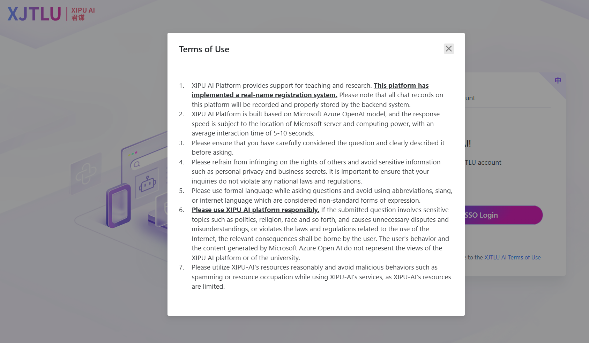

 

# Disclaimer (English Version)

This project is an open-source tool created for educational and research purposes. It aims to migrate a specific web service to a more feature-rich desktop application, enhancing the user experience by addressing limitations in the original web interface, such as knowledge base integration, extended context management, and live web search capabilities.

## Technical Design & Resource Usage

The project is technically designed to be a responsible client. It will not cause excessive or unreasonable resource consumption on the target service's servers. All API requests are initiated by the user's legitimate actions within the desktop application, intended to mirror standard user behavior in a web browser, not to perform malicious attacks, spam, or resource abuse.

## Compliance and Responsibility

1.  **Adherence to Upstream ToS**: This project acts as an unofficial client or interface for an upstream service (e.g., XIPU AI). Users of this project must be fully aware of and agree to comply with the official Terms of Service of the upstream provider. The existence of this project should not be interpreted as a method to bypass or violate those terms.
2.  **User Responsibility**: The end-user is solely responsible for all actions and requests made through this project. Users must ensure that their input, queries, and general usage comply with all applicable laws, regulations, and the terms of the upstream service. The developers of this project are not liable for any consequences arising from the user's actions (including, but not limited to, violations of regulations, privacy infringement, or the transmission of sensitive information).
3.  **Non-Commercial Use**: This project is intended strictly for personal, educational, research, and other non-commercial purposes. Any use of this project for commercial or illegal activities is strictly prohibited.
4.  **No Official Endorsement**: This is an independent, open-source project and is not officially affiliated with, authorized, endorsed, or sponsored by any upstream service provider (such as Xi'an Jiaotong-Liverpool University's XIPU AI platform).

## No Warranty

This project is provided "as is," without warranty of any kind, express or implied. The developers do not guarantee the stability, reliability, or continued availability of the project and reserve the right to update, modify, or discontinue it at any time.

We encourage all users to use this tool responsibly and in full compliance with all relevant terms, fostering a healthy and accountable open-source community. If you have any questions about these terms or witness any potential misuse, please contact us.

---

# 免责声明 (中文版)

本项目是一个出于学习和技术研究目的创建的开源工具，旨在将特定的网页服务体验迁移至功能更完善的桌面应用程序中。本项目的初衷是为了弥补原网页服务在知识库整合、长下文支持、联网搜索等方面功能的不足，为用户提供更强大、更便捷的使用体验。

## 技术与资源使用

本项目在技术实现上经过了精心设计，以确保不会对目标服务器造成额外的、不合理的资源负担。所有的API请求都基于用户在桌面端的正常、合理的操作，旨在模拟并替代用户在浏览器中的行为，而非进行任何形式的恶意攻击、垃圾信息请求或资源滥用。

## 合规性与责任

1.  **遵守上游服务条款**：本项目是作为上游服务（例如 XIPU AI 等）的一个非官方客户端或接口工具。用户在使用本项目时，必须完全知晓并同意遵守上游服务的官方使用条款。本项目的存在不应被视为对上游服务条款的任何形式的规避或违反。
2.  **用户责任**：所有通过本项目发起的请求和行为，其责任均由最终用户承担。用户必须确保其输入的内容、提出的问题以及使用方式符合所有相关的法律法规及上游服务提供方的规定。开发者不对用户的任何行为（包括但不限于违反规定、侵犯隐私、发布敏感信息等）所导致的任何后果负责。
3.  **非商业用途**：本项目仅限于个人学习、研究和非商业用途。严禁将本项目用于任何商业目的或非法活动。
4.  **无官方背书**：本项目为独立开发的开源项目，与任何上游服务（如 西交利物浦大学 XIPU AI 平台）均无官方关联，未曾获得其任何形式的授权、认可或背书。

## 无保证

本项目按“原样”提供，不提供任何形式的明示或暗示的保证。开发者不保证项目的稳定性、可靠性或持续可用性，并保留随时更新、修改或终止本项目的权利。

我们鼓励所有用户在合法合规的前提下使用本工具，共同维护一个健康、负责任的开源社区环境。如果您对上述条款有任何疑问，或发现任何潜在的违规使用行为，请联系我们。
