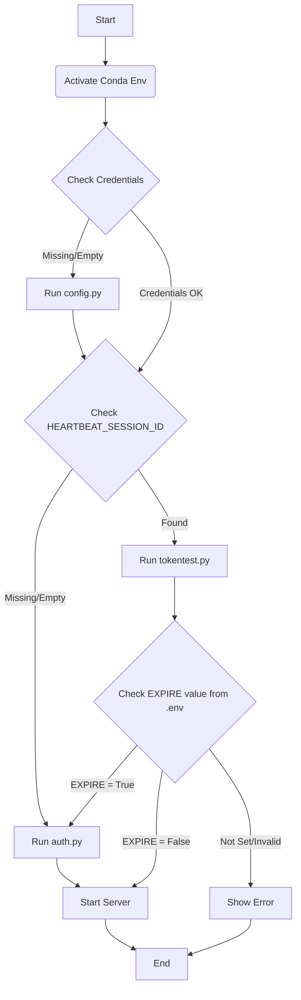

# XIPUAI-to-OpenAI-compatible-API

## Table of Contents

[English](README.md)/[简体中文](README-zh.md)

- [Overview](#overview)
- [Background](#background)
- [How to Use](#how-to-use)
  - [Prerequisites](#prerequisites)
  - [Step-by-Step Guide](#step-by-step-guide)
- [How It Works](#how-it-works)
- [Pitfalls & Lessons Learned](#pitfalls--lessons-learned)
- [Common Errors](#common-errors)
- [To do list](#to-do-list)

## Overview

This project transforms the XIPUAI web service into an OpenAI-compatible API, enabling API calls that support knowledge bases, context, web search, temperature settings, and more.

!!!!!!!!!!!!!!!!!!!!!!!!!!!!!!!!!!!!!!!!!!!!!!!!!!!!!!!!!!!!!!!!!!!!!!!!!!!!!!!!!!!!!!!!!!!!!!!!!!!!!!!!!!!!!!!!!!!!!!!!!!!!!!!!!!

<mark>Click the video link for a preview: https://drive.google.com/file/d/1-OGXcUYPfYZpAO9FbemmOAfxXSMPdFfM/view?usp=sharing</mark>

!!!!!!!!!!!!!!!!!!!!!!!!!!!!!!!!!!!!!!!!!!!!!!!!!!!!!!!!!!!!!!!!!!!!!!!!!!!!!!!!!!!!!!!!!!!!!!!!!!!!!!!!!!!!!!!!!!!!!!!!!!!!!!!!!!

## Background
I was inspired by a project that reverse-engineered Google AI Studio into an OpenAI-formatted API service, allowing free use of the popular Gemini 2.5 Pro model ([CJackHwang/AIstudioProxyAPI](https://github.com/CJackHwang/AIstudioProxyAPI)).
Seeing expensive models like Claude 3 Opus and Sonnet 3.7 on the XJTLU AI platform (a playful nickname for which is Xipu AI), I had the same idea.

## How to Use

### Prerequisites

- An XJTLU student or faculty account.
- See [libraries](libraries) for a list of dependencies.
- Developed on Windows 11.
- The `auth` module requires the Google Chrome browser to be installed.
- A chat client that supports OpenAI-compatible APIs, such as [Cherry Studio](https://github.com/CherryHQ/cherry-studio.git) or [DeepChat](https://github.com/ThinkInAIXYZ/deepchat.git).

### Step-by-Step Guide

#### Environment Setup
- Download the [environment.yml](environment.yml) file to an empty local folder.
- Open a command prompt or terminal in that folder.
- Create the conda environment from the file:
  `conda env create -f environment.yml`
- Activate the environment:
  `conda activate genai_project`

#### Initial Configuration
- In the same terminal window, run the configuration script:
  `python config.py`

  Enter your XJTLU username and password. The script will generate a `.env` file to store your credentials, so you won't have to enter them again. _Please protect your personal information!_
- Run the authentication script to get a token:
  `python auth.py`
  No user interaction is required during this step; just wait for the terminal to confirm completion. (This requires Google Chrome to be installed).
- Start the adapter service:
  `uvicorn adapter:app --reload`

  This will also create a `log` folder in the project directory for storing logs.
- Connect your Desktop Client:
  Create a new provider, select the 'OpenAI Compatible' type. The API Key can be any random string of letters. Set the Base URL to `http://127.0.0.1:8000/v1/chat/completions`.

  Fetch the available models. The model list is hardcoded in the program and cannot be fetched in real-time. Directly entering a valid model ID will pass it to the web service.

#### Trying It Out
Start a new chat, select a model, and begin your conversation.

## How It Works

### config.py

This is a simple script for storing credentials. The user enters their username and password once, and the script writes them to a `.env` file in the root directory. This allows for automatic credential loading in the future, avoiding repetitive input.

---
### auth.py

- Retrieves the username and password from the `.env` file.
- Launches a temporary Chrome window.
- Simulates the user entering their credentials and clicking "Log In".
- Intercepts the necessary authentication token and saves it to the `.env` file.

Each time a new token is fetched, it overwrites the old one.

---

### expire.py
Use base64 to decode the JWT_TOKEN in the `.env` in the same directory to obtain relevant information. This is only used for exploration and does not affect the actual use effect.

---

### run.bat
Run commands in sequence to avoid manual input by the user

---
### adapter.py

When a desktop client (like Cherry Studio) sends a chat request to our adapter, the following sequence of events unfolds:

1.  **Receive the Request (`chat_proxy`)**:
    *   FastAPI receives a `POST /v1/chat/completions` request that conforms to the OpenAI format.
    *   We immediately parse the JSON payload, which contains the `model`, `temperature`, `messages` array, and all other necessary information.

2.  **Create an Independent Session (`create_new_session`)**:
    *   This is the **cornerstone** of the entire process. We **immediately** send a `POST` request to the school's `saveSession` endpoint.
    *   The payload of this request includes all parameters from the client's request, such as `model` and `temperature`.
    *   **Key Insight**: We discovered that this endpoint allows us to configure all parameters at the moment of session creation, getting everything done in one step.
    *   The server returns a brand new, unique `sessionId`. This session acts as a "disposable sandbox" dedicated solely to this single chat request.

3.  **Construct the Full Context (`prompt_parts` & `join`)**:
    *   We read the entire `messages` array (including `system`, `user`, and `assistant` roles and their content).
    *   We use the simplest, most direct method: concatenating them into a single, massive text string formatted as `Role: Content`, separated by newlines.
    *   **Key Insight**: We confirmed that the backend server is powerful enough to process this "kitchen sink" prompt containing raw text, Markdown, and code snippets. We don't need to perform complex prompt engineering or content truncation on our end.

4.  **The Crucial Strategic Delay (`asyncio.sleep`)**:
    *   After successfully creating the session and preparing the `prompt`, we **intentionally pause the program** for a short period (`INTER_REQUEST_DELAY`, typically 1 second).
    *   **Key Insight**: This is the **lifeline** that ensures the project's stability. It solves the `429 Too Many Requests` error that plagued us for so long. The root cause was a limit on the **overall API request frequency**, not on any single endpoint. This delay creates a sufficient time gap between the "create session" and "send chat" network requests, mimicking real user behavior and perfectly circumventing the rate limit.

5.  **Send the Chat and Stream the Response (`stream_generator`)**:
    *   After the delay, we send a **streaming** `POST` request to the school's `completions` endpoint.
    *   The payload contains the `sessionId` we just created and the massive `full_prompt`.
    *   We receive text chunks from the server in real-time, repackage them into OpenAI-formatted `chunks`, and stream them back to the desktop client. This provides the "typewriter" effect for the user.

6.  **Automatic Cleanup (`finally` & `delete_session`)**:
    *   When the chat stream ends (whether normally or due to an error), the `finally` block in the `stream_generator` is triggered.
    *   **Key Insight**: We found that the server limits the total number of active sessions a user can have (to 50). To avoid exhausting this pool, we must "burn after reading."
    *   The `finally` block starts a **background async task** that calls the `delete_session` function.
    *   This background task sends a `POST` request to the school's `delSession` endpoint, including the `sessionId` that was just used, to permanently delete it from the server.
    *   This "garbage collection" mechanism is the guarantee that our "stateless" model can operate long-term.

This process forms a perfect closed loop: **Create -> Use -> Destroy**. Every conversation is a new, independent interaction that does not rely on the server's historical state, giving the desktop client full control over the context.

---

### Pitfalls & Lessons Learned

This journey was like navigating through a thick fog, setting a course based on limited clues, hitting an iceberg, and then recalibrating.

#### Pitfall #1: The Back-and-Forth on Context Handling

*   **Symptom**: The model seemed to have "amnesia," unable to understand multi-turn conversations or responding with "I don't understand" to long texts from a knowledge base.
*   **Initial Attempt (v1-v4)**: We simply concatenated all history into one big string. This worked for simple chats but failed with complex knowledge bases.
*   **The Wrong Turn (v4 - "Session State" Simulation)**: We mistakenly assumed we should mimic the web UI's stateful behavior, sending only the last user message and relying on the server's `sessionId` to maintain context. **This was our biggest detour**, as it contradicted our goal of building a stateless, client-controlled API. It resulted in a model with no context, which naturally couldn't answer correctly.
*   **Another Attempt (v8 - "Session Injection")**: We devised a "clever" method of trying to rebuild context on the server turn-by-turn with multiple POST requests. This failed due to excessive request frequency.
*   **The Final Epiphany (v10)**: Your observation—that the web UI could "swallow a huge chunk of text at once"—made us realize that the simplest approach was the right one. The problem wasn't *how* to send the context, but rather **what kind of context the backend could handle** and **how fast we were sending it**.

#### Pitfall #2: The Mysterious "Async" Problem and the 429 Error

*   **Symptom**: Frequent `Request too fast` or `429 Too Many Requests` errors.
*   **Initial Attempt (v2/v3 - The "Ammunition Depot" Model)**: We designed an elaborate asynchronous "ammo box" (`session_id_ammo_box`) to pre-fetch the next session ID in the background while processing the current request, intending to boost efficiency.
*   **The Fatal Concurrency**: The problem was that the background "pre-fetch" request (`saveSession`) and the foreground "update parameters" request (also `saveSession`) were happening **within milliseconds of each other**. The server's rate-limiting mechanism immediately flagged this **concurrent access** as abnormal, causing it to fail.
*   **The Wrong Solution (v8 - "Session Injection")**: We abandoned the "ammo box," but the new "session injection" logic introduced an even denser sequence of requests, triggering the same rate limit.
*   **The Final Epiphany (v6, v10)**: We finally understood that **the key wasn't concurrency, but frequency**. We didn't need a complex async queue; we just needed a simple, human-like `asyncio.sleep()` between consecutive API calls. This tiny delay was the "silver bullet" that solved all our rate-limiting problems.

#### Pitfall #3: Misinterpreting Error Messages

*   **Symptom**: The 429 error returned by the server included the message `...adjust the length of the context...`.
*   **The Wrong Assumption (v9)**: We took this message at face value and assumed the text was too long. This led us to develop an "intelligent truncation" module.
*   **A Fortunate Coincidence**: Although based on a false premise, this truncation module **happened to work**. We later realized its success was not due to the truncation itself, but because of the **incidental request delay** it introduced and its potential to **unintentionally clean "toxic" characters** from the text.
*   **The Final Epiphany (v10)**: Your final tests proved that the backend could handle long text without truncation, as long as there was a delay. This taught us a profound lesson: **API error messages don't always reveal the root cause of a problem; sometimes, they are a smokescreen**. Reverse engineering requires bold hypotheses but, more importantly, careful verification.

## Common Errors
|Error|Reason|Measure|
|--|--|--|
|`403`|Token expired|Re-run auth.py|
|`don't have relevant knowledge`|Enter "poison text", the backend cannot read it|Delete the last conversation of this session|

## To do list
- [ ] automatic keep-alive
